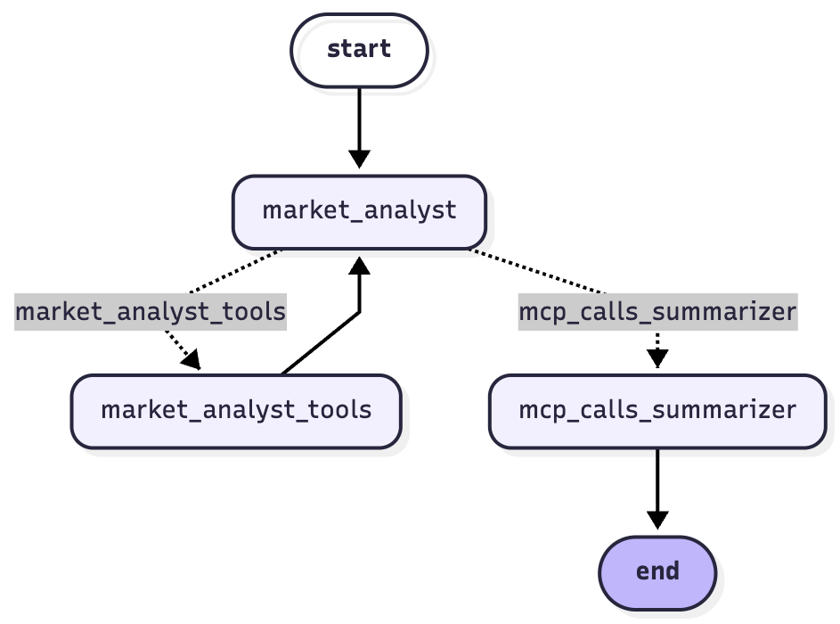
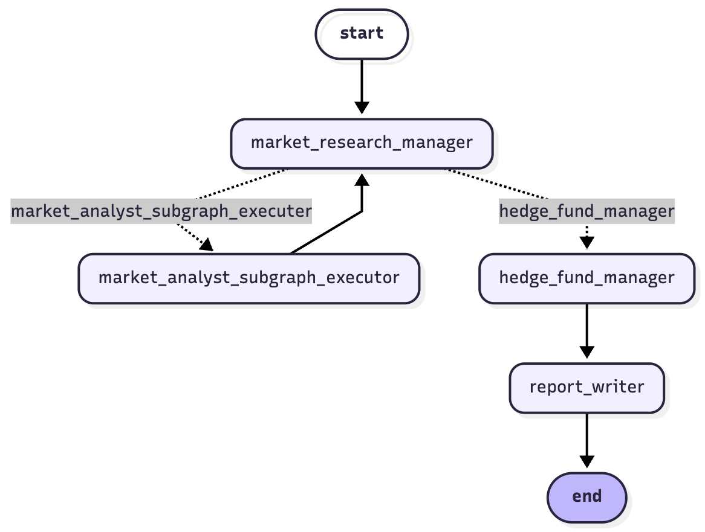

# Stocks Investment Recommender

### Example Multi-Agent Stock Analysis System Built on [LangGraphWrappers](https://github.com/Omer-Pinto/LangGraphWrappers)

The **Stocks Position Recommender** project demonstrates a complete, agentic, multi-stage **LangGraph** pipeline for stock market analysis and investment recommendation.  
It leverages the infrastructure from my infra project **LangGraphWrappers** to build two modular and interlinked graphs:

- 🧠 **Market Analyst Graph** – performs detailed financial and market data analysis. Used as a subgraph within external graph node execution.  
- 🕹️ **Agentic Stock Analyzer Graph** – orchestrates higher-level “agentic” reasoning and controls when and how the subgraph executes.

This project highlights how **LangGraphWrappers** can scale to complex multi-graph orchestrations, providing structured, modular, and reusable flows across agents, subgraphs, and tool integrations.

---

## 🧩 Architecture Overview

### 1. Market Analyst Graph (inner sub-graph)

The **Market Analyst Graph** focuses on data analysis, financial insights, and structured reporting.  
It initializes models, tools (mainly exposing [Yahoo Finance MCP](https://github.com/Alex2Yang97/yahoo-finance-mcp) as LangGraph tool), and nodes that perform core analytical tasks.

#### 🔧 Key Nodes
- **market_analyst** - the main analytical agent node, given a general financial question and decides which MCP endpoints (tools) should be called to answer that question.  
- **market_analyst_tools** - a tool node that handles all tool-based operations such as financial data queries via Yahoo Finance MCP (one or many).  
- **mcp_calls_summarizer** - another agent node that creates a full report for results from multiple MCP calls and add agentic insights. It uses Pydantic pre-configured structured output.

#### 🗺️ LangGraph Flow Diagram


- The flow begins with `start`, passes through `market_analyst` with the query to analyze. This node then decides which MCP calls (exposed to it as different tools) to call.
- Control then passes to `market_analyst_tools` tool node to perform the mcp call(s).
- Once finished, control passes back to `market_analyst`, which then passes it to `mcp_calls_summarizer` (this is the common flow in LangGraph. Tool node will return to its sender).
- The `mcp_calls_summarizer` node will produce structured analytical results + insights (of type `AnlysisOutput` defined in `structured_outputs.py`).
- The edges coming out of `market_analyst` are both conditional nodes, as the control may go either way - and is controlled by a **router** defined in the relevant `routers.py`.
- `mcp_calls_summarizer` is directly connected to the `end`, marking this subgraph end of flow. 

---

### 2. Agentic Stock Analyzer Graph

The **Agentic Stock Analyzer Graph** is the top-level “decision-maker”.  
It encapsulates the **Market Analyst Graph** as a **subgraph** (executed within a node of this external graph), controlling its invocation dynamically based on analysis needs.

This graph introduces an **agentic reasoning loop** — the `market_research_manager` node decide *if*, *how*, and *how many times* to run the analytical subgraph depending on context, prior outputs, or confidence.

#### 🔧 Key Nodes
- **market_research_manager** – main agentic node that orchestrates analysis flow and delegates to subgraphs (for analysis) or to the `hedge_fund_manager` (for decision), given a general query - usually of the form *should I invest in X?* 
- **market_analyst_subgraph_executer** – triggers the Market Analyst subgraph dynamically (this is not an agentic node by itself, as no model is directly called by it, so it is of a `PythonNodeWrapper` type from LangGraphWrappers repo).
- **hedge_fund_manager** – once `market_research_manager` decides he gathered enough info about the stock, this agentic node interprets aggregated results and makes investment decisions (including full reasoning).  
- **report_writer** – this non-agentic node (again `PythonNodeWrapper`) generates structured reports summarizing the investment rationale in an output file.

#### 🗺️ Flow Diagram


- The flow begins with `start`, passes through `market_research_manager` with the stock to decide if and how to invest. 
As detailed in the prompt, this graph is expected to produce a result in the range [-1,1] (-1 recommends a total short position and 1 a total long position) + confidence level in range [0,1]. 
The agent in this node should come up with the relevant analysis questions (plural!) to be asked. It is aware of the MCP used **but not directly** using it (prompt forbids it).
- Control then passes to `market_analyst_subgraph_executer` (non-agentic, `PythonNodeWrapper` node) which calls a subgraph of `market_analyst_graph` **per input query in parallel(!)**. Note: this uses asyncio `gather` functionality within the node and not LangGraph native parallelism (single edge between manager and executer and not many) as I don't know the number of queries in advance).
- Once sub-graph execution is finished, query results are added to graph state and control passes back to `market_research_manager`. 
Note that a one-to-many relation exists between each manager's query and eventual MCP calls. Basically what happens behind the scene is the following: for each manager's query (usually there are much more than 1 in each loop), the inner analyst comes up with one or more MCP calls.
- The `market_research_manager` should look at the results passed back to it against all his prior queries and decide: should I move to investment decision with the `hedge_fund_manager` or continue to another round to the executer.
This is a classic agentic loop. If he decides he needs more info, he sends another set of queries towards the executer, which eventually might result in many-to-many-to-many kind of data - multiple request-analysis-rounds of multiple manager queries translated to multiple groups of mcp calls!
This complexity takes place in the state structure (look at the relevant node actions code).
- When the `market_research_manager` will eventually be satisfied, he will move control to the `hedge_fund_manager`.
In this grpah I've decided to use a router that depends on `analysis_phase` field of state, filled by the manager.
- Agentic node `hedge_fund_manager` will analyze all the mcp data, queries and summarizations from state, and will give a fully reasoned investment decision + his confidence level. 
- Control will eventually get to non-agentic `report_writer` node to output all results (analysis + decision) to file. 
I've decided to do that as part of the LangGraph graph and not post-graph execution python, because it is part of the flow and I think it is great I can look at it also in the wonderful LangSmith traces.  

---

## ⚙️ Implementation Details

### 🧱 Infrastructure

Both graphs are implemented using the **LangGraphWrappers** infrastructure, which provides:
- `GraphWrapper`, `NodeWrapper`, and `EdgeType` for concise LangGraph definition.
- Model management via `ModelWrapper`.
- Tool lifecycle via `ToolsWrapper` and MCP integration utilities.

---

### 📂 Repository Structure

```
src/
├── main.py                             # Entry point – run agentic or analyst graphs
│
├── agentic_stock_analyzer_graph/
│   ├── graph_manager.py                # Builds & runs the agentic flow graph
│   ├── node_actions.py                 # Defines node actions (agentic and pyton)
│   ├── routers.py                      # Routing logic for manager node (conditional edges)
│   ├── state.py                        # Shared state and phase definitions
│   ├── structured_outputs.py           # Pydantic-based investment decision schemas
│   ├── tools_setup.py                  # tools setup and teardown using LangGraphWrappers APIs
│   ├── utils.py                        # Graph node enum
│
├── market_analyst_graph/               
│   ├── graph_manager.py                # Builds & runs the analyst subgraph
│   ├── node_actions.py                 # Defines node actions (agentic and pyton)
│   ├── routers.py                      # Routing logic for analyst node (conditional edges)
│   ├── state.py                        # Shared state and phase definitions
│   ├── tools_setup.py                  # tools setup and teardown using LangGraphWrappers APIs
│   ├── utils.py                        # Graph node enum
│
└── outputs/                            # Example runs and generated results
    ├── Berkshire Hathaway_.../
    ├── Nvidia_.../
```

---

## 🚀 Running the Graphs

### 1. Environment Setup

```bash
uv sync
```

Make sure `.env` contains your **OpenAI API key**. There is some support for other vendors models (see LangGraphWrappers repo).

---

### 2. Running the Market Analyst Graph

mark / unmark relevant query & `asyncio.run` command under `if __name__ == "__main__"` and run 
```bash
uv run src/main.py
```

---

### 3. Running the Agentic Stock Analyzer Graph

mark / unmark relevant query & `asyncio.run` command under `if __name__ == "__main__"` and run 

```bash
uv run src/main.py
```

The script defaults to running the **agentic** flow, which builds upon the Market Analyst subgraph.
Sorry for inconvenience, if someone needs it I'll add a console application to decide between the two graphs.

#### Example
```python
from agentic_stock_analyzer_graph import GraphManager

query = "Should I invest in Berkshire Hathaway?"
graph = GraphManager()
await graph.setup()
await graph.run_graph(query=query, company="Berkshire Hathaway")
await graph.cleanup()
```

This will:
1. Initialize the full agentic graph.
2. Dynamically invoke the subgraph multiple times as needed.
3. Produce a final structured investment recommendation under `/outputs/{company}_.../`.

---

## 📊 Example Output

Each run produces:
- **`user_query.txt`** – the original query.
- **`investment_decision.json`** – the final structured recommendation (Pydantic class `InvestmentDecision`).
- **`work_report.json`** – intermediate reasoning and tool results (a list of Pydantic class `FinalQueryResult`)

Example output directory:
```
outputs/
└── Nvidia_2025_10_26-02_09_36/
    ├── user_query.txt
    ├── work_report.json
    └── investment_decision.json
```

---

## 🧠 Design Highlights

- **Agentic Control Flow** – The main graph autonomously decides when and how often to invoke analytical subgraphs.
- **Reusable Subgraphs** – The Market Analyst Graph is reusable and standalone.
- **Structured State Management** – Each phase (e.g., `Phase.QUERY`, `Phase.DECIDE`) and intermediate results are tracked through LangGraph state in the agentic graph
  (and not through messages history). In the analyst subgraph I used the less effective, less structure message history for control. 
When using `state` for control, I used the `ControlMessage` specialized class added in LangGraphWrappers to allow special control message that keeps the track on what's going on in 
the ever-growing customary messages list.
- **Tool Integration** – Includes Yahoo Finance MCP as LangGraph tool for financial data retrieval.
- **Pydantic Structured Outputs** – Ensures every decision and report follows a validated schema.

---

## 📜 License

MIT License © 2025 [Omer Pinto](https://github.com/Omer-Pinto)

---

## 🧭 Future Directions

- Extend **reporting layers** (e.g.: add push notification with the final decision).  
- Add **graph visualization utilities** for runtime flow tracing (currently malfunctions due to node enum naming. I added a utility that prints Mermaid mmd file that can be used with small fix in online viewer!).  
- Enhance **tool capabilities** with more analytic financial tools and agent specialties (e.g.: options analyzer using *Black–Scholes formula* or futures specialist).  
- Explore **multi-agent coordination** beyond two-graph interaction (can be used for incorporating more specialized agents with additional tools).
